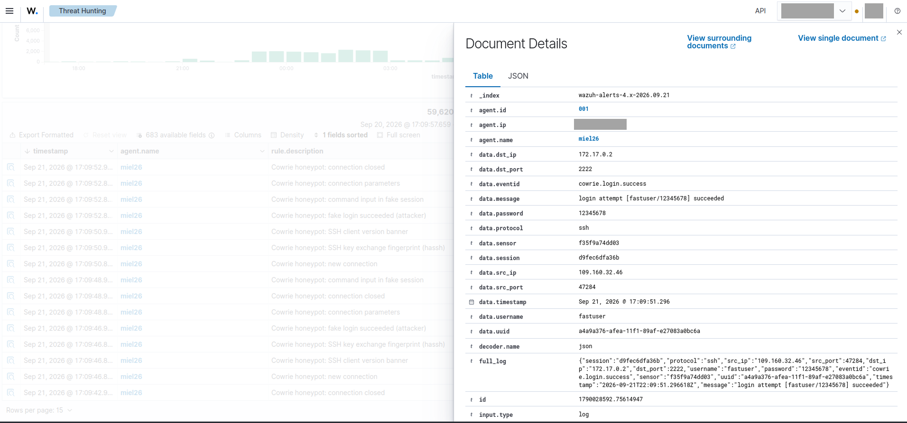

# 09-report

Final report and portfolio piece for the home SOC lab: what was built, what it captured, the incident it survived, how it was hardened, and how the loop keeps running.

## What was built

A small but fully working SOC pipeline across two machines:

- **miel26** (GCP e2 VM): Cowrie low-interaction honeypot exposing fake SSH, Telnet, HTTP, SMB, RDP and MySQL services to the internet.
- **asgard** (home server): Wazuh SIEM ingesting honeypot telemetry, plus Prometheus + Grafana monitoring of both hosts and a Wazuh→Telegram alert forwarder.

Iterated in eight phases, each documented in its own folder:

| Phase | What it covers |
|-------|----------------|
| [01-infra](../01-infra/) | Provisioning scripts for the VPS and the home server |
| [02-honeypot](../02-honeypot/) | Cowrie deployment, fake services, logging setup |
| [03-siem](../03-siem/) | Wazuh manager, agent enrollment, log pipeline |
| [04-detecciones](../04-detecciones/) | Detection rules and alert mapping for honeypot events |
| [05-visualizacion](../05-visualizacion/) | Grafana dashboards and the Wazuh→Telegram forwarder |
| [06-observaciones](../06-observaciones/) | Attack timeline: dates, source IPs, TTPs, evidence |
| [07-respuesta](../07-respuesta/) | Triage and response runbooks |
| [08-endurecimiento](../08-endurecimiento/) | Post-incident hardening with verification notes |

## What was captured

Verified against OpenSearch (SIEM query, mid-September 2026):

| Metric | Value |
|--------|-------|
| Cowrie events indexed | **20,941** |
| Distinct attacker source IPs | **58** |
| Honeypot sessions | **732** |

The bulk of the traffic is mass-scanner botnet activity: scripted SSH brute-force, fake logins accepted by Cowrie, recon commands (`uname -s -v -n -r -m`), and dropper-style command input — all recorded with zero risk to real services.



## Case study: the 2026-09-16 incident

Full write-up in [06-observaciones/2026-09-16_ssh-bruteforce-martian-spoofing.md](../06-observaciones/2026-09-16_ssh-bruteforce-martian-spoofing.md). Summary:

- Two attacker IPs (`109.160.32.48`, `195.178.110.228`) ran an automated SSH dropper campaign against the honeypot: 190 connections, 158 fake logins, 150 commands in ~18 minutes from the noisiest source.
- The same sources sent **martian packets**: frames arriving on the public interface claiming to come from `172.17.0.2` — the honeypot's own Docker bridge IP. The kernel dropped all of them.
- The traffic surge coincided with a **13.5-hour telemetry blackout** (07:33:59 → 21:38:08 UTC). Root cause chain: memory pressure on the 1 GB e2-micro during the spike, and `wazuh-agent` not enabled as a service, so nothing self-healed until a manual reboot.

The incident is the lab's best artifact: it shows detection working (the campaign is fully logged up to the blackout), its own observability failure mode (a blind honeypot), and the recovery path.

## Hardening applied

Post-incident actions, documented with verification evidence in [08-endurecimiento](../08-endurecimiento/):

- **Deliberate non-action:** attacker IPs were *not* blocked in the VPC firewall — they are rotating botnet nodes, the honeypot's value is observing them, and containment already comes from the Cowrie sandbox.
- **`wazuh-agent` enabled** via `systemctl` (it was installed but never enabled — the fix that closes the self-DoS recovery gap).
- **VM resized** e2-micro → e2-small (2 GB) to absorb scan spikes.
- **Real SSH (port 2222) restricted** to the operator's home IP in the GCP firewall; it had been leaking to `0.0.0.0/0` through the honeypot decoy rule. Only the fake services remain internet-facing.

## What was learned

- **Instrument first, expose second.** Every hardening decision in this lab was driven by observed traffic, not by a checklist.
- **A honeypot without telemetry self-healing is a blind honeypot.** The most damaging "attack" was a resource spike plus a missing systemd unit.
- **Low-interaction containment holds.** 20k+ events of hostile input produced zero impact outside the sandbox; the kernel handled even source-spoofed packets on its own.
- **Evidence hygiene is part of the SOC job.** Timelines, verified numbers, and published-with-verification hardening notes are what make this a portfolio and not a screenshot folder.

## How the loop keeps running

The lab operates as a continuous cycle:

```
observe (06) → triage (07) → respond (07) → harden (08) → observe again
```

Day to day: Cowrie keeps collecting, Wazuh keeps correlating, Grafana watches host health, and Telegram pushes the high-value events (fake logins, command input, agent state changes) so triage starts from a phone, not from a dashboard check. Each new observation feeds `06-observaciones`, and anything actionable becomes a new hardening entry in `08-endurecimiento`.

Next candidates: TheHive/Cortex for case management, additional decoy services, and tighter alert tuning as baseline noise is better understood.

## Evidence

Screenshots referenced across the portfolio live in [../screenshots/](../screenshots/):

| Shot | Phase |
|------|-------|
| [01-setup](../screenshots/01-setup.png) | Infrastructure |
| [02-cowrie](../screenshots/02-cowrie.png) | Honeypot live capture |
| [03-wazuh](../screenshots/03-wazuh.png) | SIEM dashboard |
| [04-alerts](../screenshots/04-alerts.png) | Detections |
| [05-grafana](../screenshots/05-grafana.png) | Visualization |
| [06-triage](../screenshots/06-triage.png) | Incident triage |
| [07-telegram](../screenshots/07-telegram.png) | Alerting |
| [08-hardening](../screenshots/08-hardening.png) | Post-incident hardening |

This README's GitHub render is the closing shot (09) of the portfolio.
