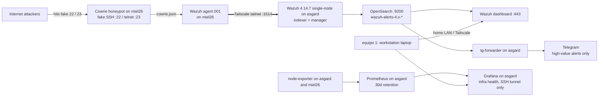
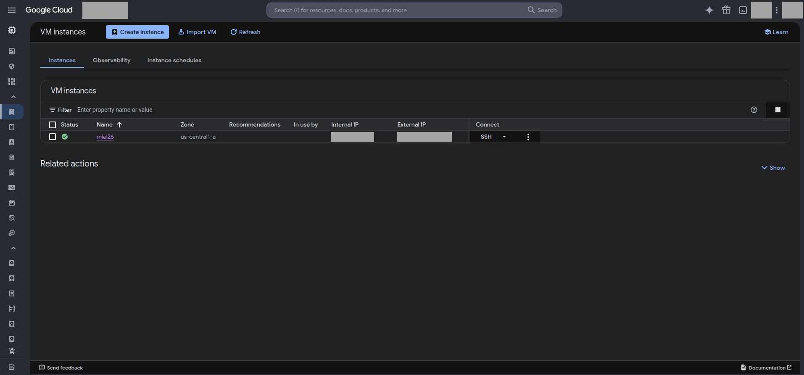
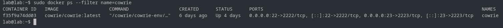
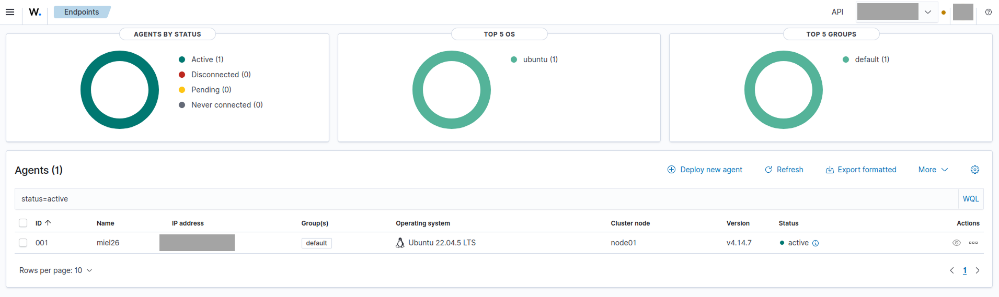
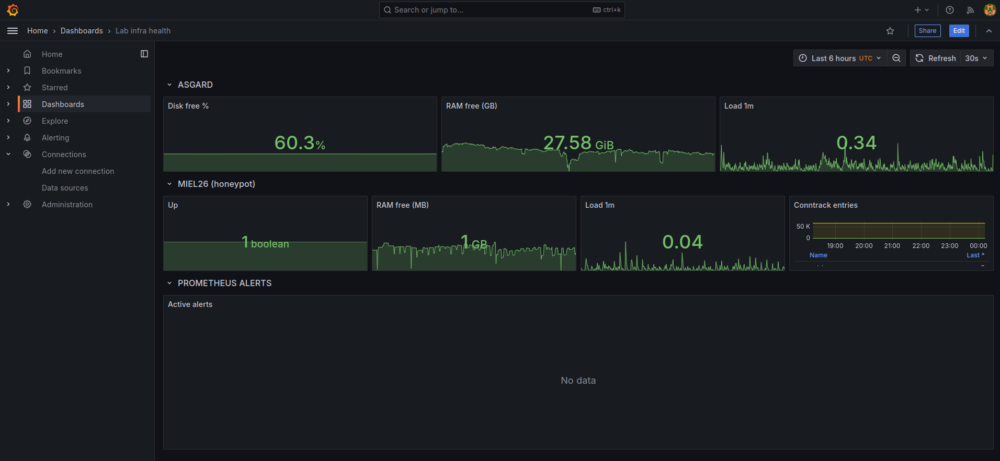
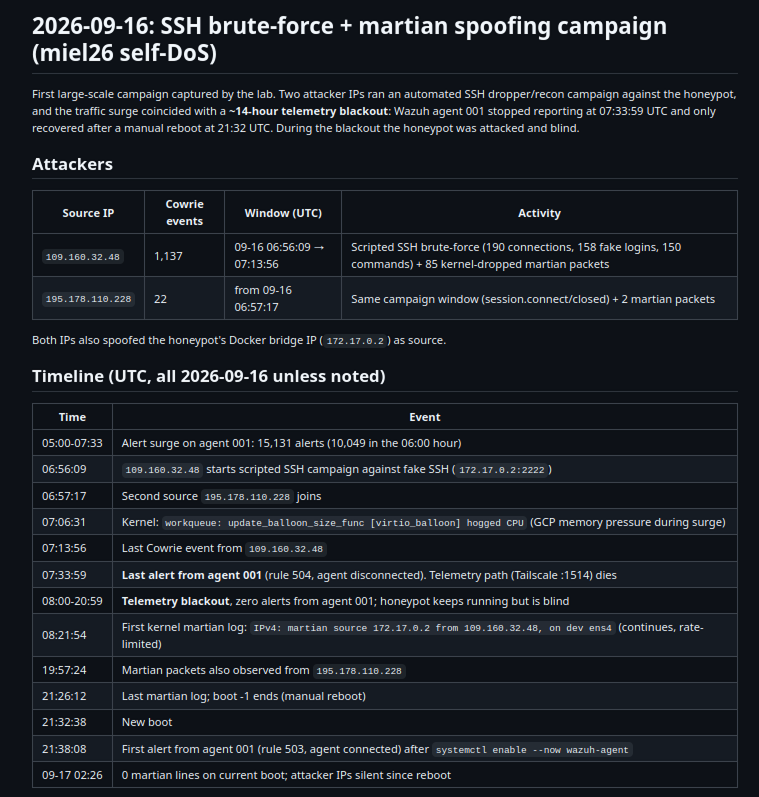
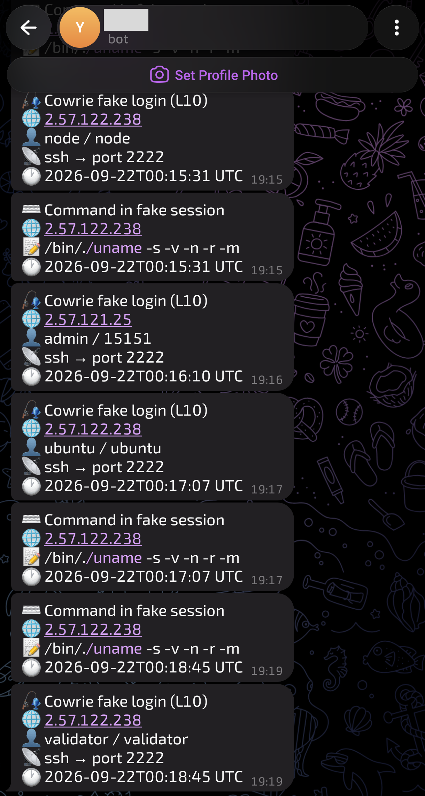
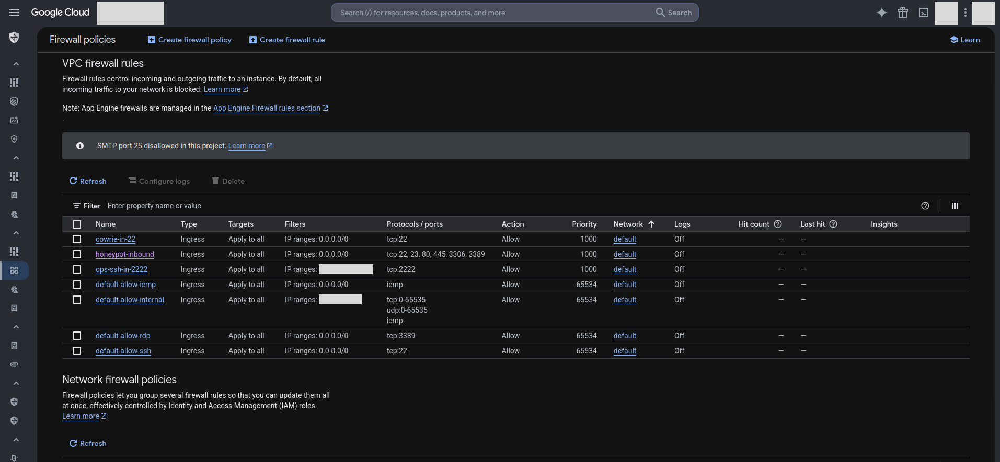

English: [README.md](README.md)

# SOC Lab: del honeypot Cowrie al SIEM Wazuh

## Qué es

Este repositorio documenta un pipeline SOC real y completo, construido con un presupuesto pequeño. Un honeypot Cowrie orientado a Internet registra cada intento de login falso y cada comando, y los logs viajan por una red privada Tailscale hasta un SIEM Wazuh que indexa las alertas en OpenSearch. Un stack de Grafana + Prometheus vigila la salud de la infraestructura, y un forwarder Python envía las alertas de alto valor a Telegram.

El laboratorio funciona como un bucle de práctica para SOC Lvl 1: detectar, ingerir, monitorear, triar, responder, endurecer y documentar. El laboratorio está en vivo; el monitoreo continúa y las alertas siguen llegando.

## Cómo funciona

El bucle, en palabras:

1. Un escáner o nodo de botnet golpea un servicio falso en miel26 (SSH :22 / telnet :23).
2. Cowrie simula un login exitoso y registra cada credencial y cada comando en JSON.
3. El agente Wazuh en miel26 lee ese archivo de log y envía los eventos al manager por la tailnet de Tailscale (puerto 1514).
4. Wazuh correlaciona los eventos contra las reglas personalizadas de Cowrie y genera alertas.
5. Las alertas se indexan en OpenSearch y aparecen en el dashboard de Wazuh.
6. El forwarder consulta OpenSearch por las reglas de alto valor y envía mensajes a Telegram. Prometheus y Grafana vigilan los hosts.
7. Cada ataque observado se convierte en un registro en `06-observaciones/`, una decisión de triaje en `07-respuesta/`, endurecimiento en `08-endurecimiento/` y el informe en `09-report/`.

La regla de seguridad del laboratorio: todos los puertos del SIEM y del monitoreo (443, 9200, 3000, 9090, 9100, 1514) son alcanzables solo desde la LAN de la casa y la tailnet. Los puertos del honeypot (22/23) están abiertos al mundo a propósito: son el señuelo.

## Las máquinas

| Nombre | Qué es | Qué corre | Exposición |
|--------|--------|-----------|------------|
| equipo 1 | Laptop de trabajo, solo análisis | Tailscale, cliente SSH, dashboards por el túnel | LAN de la casa. No corren servicios del laboratorio aquí |
| equipo 2 (asgard) | Servidor siempre encendido (una laptop reacondicionada, Ubuntu) | Wazuh single-node (indexer + manager + dashboard), OpenSearch, node-exporter, Prometheus, Grafana, tg-forwarder | Solo LAN de la casa + Tailscale |
| miel26 | VM en la nube (e2-small, 2 GB) | Honeypot Cowrie (Docker), agente Wazuh 001, node-exporter independiente | Puertos 22/23 abiertos a Internet a propósito; SSH de administración (2222) restringido al operador |

Tailscale es la red privada entre equipo 2 y miel26. Todo el tráfico del agente (puerto 1514) y todos los scrapes de monitoreo cruzan por esa tailnet, nunca por Internet público.

## Las fases

### 01-infra

Scripts de aprovisionamiento para ambos hosts del laboratorio. `setup-laptop.sh` convierte a equipo 2 en un servidor siempre encendido: sin sleep ni suspensión, 6 GB de swap, `vm.max_map_count` para OpenSearch, Docker, UFW con solo SSH y la tailnet abiertos, el stack Wazuh single-node y Tailscale. `setup-vps.sh` prepara a miel26: el SSH real se mueve al puerto 2222, el firewall cierra todo por defecto y abre al mundo solo los puertos del honeypot, y Cowrie queda corriendo como container de Docker.

En esta captura oculté el nombre del proyecto en la nube, los rangos de origen de las reglas de firewall y las IPs de las instancias.

### 02-honeypot

Cowrie es un honeypot de baja interacción: shells de login falsos para SSH y Telnet (y otros servicios cuando se habilitan) que registran cada credencial, comando e intento de transferencia de archivos. No hay un sistema operativo real dentro que parchear o entregar, así que el dato es el producto. El volumen docker `cowrie-data` (log JSON en `log/cowrie/cowrie.json`) es la fuente de evidencia que lee el resto del pipeline.

En esta captura oculté la IP pública del honeypot (aparece en la consola de la nube y en las reglas de firewall).

### 03-siem

Ajustes de Wazuh: una política de ciclo de vida de índices que mantiene `wazuh-*` en fase hot 14 días y luego lo elimina, el registro del agente con el localfile que lee los logs de Cowrie, y los decodificadores y reglas personalizados en `rules/`. La primera versión de las reglas nunca disparó alertas: un decodificador personalizado declarado como hijo del decodificador `json` integrado lo eclipsaba, y los campos nunca se poblaban. La lección es confirmar que el campo aparece en el payload de la alerta antes de culpar a la regla.

En esta captura oculté las credenciales del dashboard, las IPs Tailscale de los agentes y las direcciones de la LAN de casa.

### 04-detecciones

Decodificadores y reglas personalizados de Wazuh, uno por cada ataque observado. Cada regla se mapea a los IDs de técnica de MITRE ATT&CK del comportamiento que detecta, de modo que el flujo de alertas llega ya anotado con la intención del atacante.

Oculté las direcciones Tailscale y de la LAN de casa dentro de los payloads. Las IPs de origen de los atacantes quedan visibles.

### 05-visualizacion

Dos partes: las exportaciones JSON de dashboards con sus capturas, y el stack `monitoring/`. El stack combina Prometheus + Grafana para la salud de la infraestructura (disco/RAM/carga de asgard, estado y conntrack de miel26) con un forwarder Python que consulta OpenSearch por las reglas de alto valor de Wazuh y envía mensajes a Telegram. Todos los puertos quedan ligados a loopback, y Grafana se alcanza por un túnel SSH.

Oculté las direcciones Tailscale en las métricas y etiquetas de paneles, y las direcciones de la LAN de casa.

### 06-observaciones

Línea de tiempo de ataques: fechas, IPs de origen, TTPs y consultas de evidencia reproducibles para cada ataque observado. La primera entrada documenta una campaña de droppers SSH automatizados que también hacía spoofing de la IP del bridge de Docker del honeypot (paquetes martian), y el apagón de telemetría de 13,5 horas que el pico de tráfico causó hasta el reinicio manual.

Oculté mi IP pública y las direcciones Tailscale. Las IPs de origen de los atacantes quedan visibles.

### 07-respuesta

Runbooks de triaje y respuesta para los ataques observados. Los eventos de alto valor (logins falsos de Cowrie, comandos tecleados, conexión y desconexión del agente) llegan por Telegram desde el forwarder, y cada ataque termina con una decisión escrita: bloquear, observar o aceptar el riesgo.

Oculté el token del bot, el chat ID y mi nombre de usuario.

### 08-endurecimiento

Endurecimiento aplicado después de cada observación, con el razonamiento documentado. La primera pasada post-incidente (2026-09-17) decidió deliberadamente no bloquear las IPs de los atacantes en el firewall (bloquearlas interrumpiría la observación, y son nodos rotativos de botnet), habilitó el agente Wazuh en el arranque, quitó el puerto 2222 de la regla de firewall del señuelo que estaba abierta a todos, y actualizó miel26 de e2-micro a e2-small para que un pico de tráfico no vuelva a silenciar la telemetría.

Ocultar en esta captura: el nombre del proyecto en la nube, los rangos de origen de las reglas de firewall, las IPs de las instancias.

### 09-report

El informe final que ensambla las fases 01-08 en una sola pieza de portafolio: qué se construyó, qué se capturó, qué se aprendió y cómo sigue el bucle.

Oculté todo lo de la lista anterior, porque el informe reutiliza capturas del laboratorio.

## Lo que el honeypot capturó

Cifras verificadas el 2026-09-21 contra OpenSearch en asgard:

- 20.941 intentos de login SSH falsos capturados entre el 2026-09-16 y el 2026-09-21, aproximadamente 2-3 por minuto, las 24 horas.
- 58 IPs de origen distintas solo en las últimas 5.000 alertas.
- 732 combinaciones únicas de usuario/contraseña en una muestra de 1.200 logins recientes.

Las combinaciones más repetidas de esa muestra:

| Usuario | Contraseña (enmascarada) | Intentos (muestra) | IPs de origen distintas |
| --- | --- | ---: | ---: |
| root | pa****** | 15 | 5 |
| admin | ad*** | 7 | 7 |
| root | Pa******* | 7 | 5 |
| root | Aa****** | 6 | 4 |
| user | 1 | 5 | 4 |
| claude | cl**** | 5 | 3 |
| root | ad******* | 5 | 4 |
| admin | 00*** | 5 | 4 |
| opc | 12**** | 5 | 3 |
| es | e* | 5 | 3 |

Repetir el mismo grupo pequeño de combinaciones desde IPs distintas es credential stuffing. Los nombres de usuario son valores por defecto: root, admin, opc y es son cuentas de nube o de servicio, mientras que claude, minecraft y developer son suposiciones oportunistas. Las contraseñas están enmascaradas a propósito: el patrón es la lección, y republicar las cadenas completas convertiría credenciales reales de víctimas en una lista de ataque.

## Datos sensibles y reglas para las capturas

Antes de publicar cualquier captura de este laboratorio, revisarla contra esta lista:

- [ ] IP pública del honeypot: consola de la nube, reglas de firewall, páginas de instancia.
- [ ] Direcciones Tailscale (100.x.x.x) en dashboards, métricas y payloads de alertas.
- [ ] Direcciones de la LAN de la casa.
- [ ] IP pública del operador: aparece en las reglas del firewall VPC.
- [ ] Tokens y contraseñas: contraseña admin de Grafana, token y chat ID del bot de Telegram, credenciales de la API de Wazuh.
- [ ] Nombres de proyectos en la nube.
- [ ] Nombres de usuario o cuentas personales.

Las IPs de origen de los atacantes pueden seguir visibles: son el punto del laboratorio y son nodos rotativos de botnet.

## Mantenerlo en marcha

- Todos los servicios corren como containers en equipo 2 (asgard) con `restart: unless-stopped`: el stack Wazuh single-node y el stack de monitoreo (node-exporter, Prometheus, Grafana, tg-forwarder). En miel26, el container de Cowrie y el agente Wazuh se inician solos en el arranque; habilitar el agente en el arranque fue la corrección del apagón del 2026-09-16.
- Grafana queda ligado a 127.0.0.1:3000 en asgard. Desde equipo 1, abrir primero un túnel: `ssh -N -L 3000:localhost:3000 asgard`, y luego abrir http://localhost:3000.
- El forwarder tiene un modo de prueba. Con `DRY_RUN=true` (o sin token de bot) registra `WOULD SEND: ...` en vez de enviar mensajes, de modo que la lista de reglas puede verificarse antes de conectar un bot de Telegram real.
- Dónde vive el estado: el estado de Wazuh y OpenSearch en volumes de Docker en asgard, el high-water mark del forwarder en el volume `fwd-state`, y los secretos solo en `~/monitoring/.env` en asgard (chmod 600). El repositorio solo lleva `.env.example` con marcadores de posición.

## Estado actual

El laboratorio está en vivo. Las alertas siguen llegando desde el honeypot, el stack de monitoreo vigila los hosts, y el bucle de observación, triaje y endurecimiento continúa a medida que aparecen nuevas campañas. Este repositorio documenta la construcción al 2026-09-21, y las carpetas de fases se siguen actualizando a medida que el laboratorio evoluciona.
