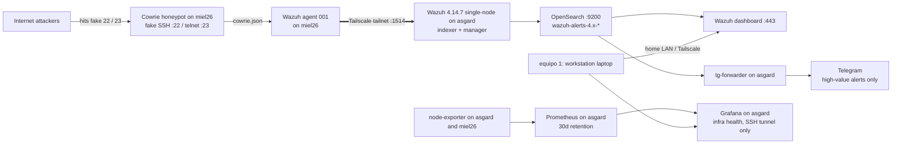

Español: [README.es.md](README.es.md)

# SOC Lab: Cowrie honeypot to Wazuh SIEM

## What this is

This repository documents a real, complete SOC pipeline built on a small budget. An internet-facing Cowrie honeypot records every fake login and command, and the logs flow over a private Tailscale network into a Wazuh SIEM that indexes the alerts in OpenSearch. A Grafana + Prometheus stack watches infrastructure health, and a small Python forwarder sends the high-value alerts to Telegram.

The lab runs as a SOC Lvl 1 practice loop: detect, ingest, monitor, triage, respond, harden, document. It is live. Monitoring continues, and alerts keep arriving.

## How it works

The loop in words:

1. An internet scanner or botnet node hits a fake service on miel26 (SSH :22 / telnet :23).
2. Cowrie fakes a successful login and records every credential and command to JSON.
3. The Wazuh agent on miel26 tails the log file and ships the events to the manager over the Tailscale tailnet (port 1514).
4. Wazuh correlates the events against custom Cowrie rules and raises alerts.
5. Alerts are indexed in OpenSearch and surface in the Wazuh dashboard.
6. The forwarder polls OpenSearch for the high-value rules and messages Telegram. Prometheus and Grafana watch the hosts themselves.
7. Each observed attack becomes a record in `06-observaciones/`, a triage decision in `07-respuesta/`, hardening in `08-endurecimiento/`, and the write-up in `09-report/`.

The security rule of the lab: every SIEM and monitoring port (443, 9200, 3000, 9090, 9100, 1514) is reachable only from the home LAN and the tailnet. The honeypot ports (22/23) are open to the world on purpose. They are the bait.

## The machines

| Name | What it is | What runs on it | Exposure |
|------|-----------|-----------------|----------|
| equipo 1 | Workstation laptop, analysis only | Tailscale, SSH client, dashboards through the tunnel | Home LAN. No lab services run here |
| equipo 2 (asgard) | Always-on home server (a repurposed laptop, Ubuntu) | Wazuh single-node (indexer + manager + dashboard), OpenSearch, node-exporter, Prometheus, Grafana, tg-forwarder | Home LAN + Tailscale only |
| miel26 | Cloud VM (e2-small, 2 GB) | Cowrie honeypot (Docker), Wazuh agent 001, standalone node-exporter | Ports 22/23 open to the internet by design. Management SSH (2222) restricted to the operator |

Tailscale is the private network between equipo 2 and miel26. All agent traffic (port 1514) and all monitoring scrapes cross that tailnet, never the public internet.

## The phases

### 01-infra

Bootstrap scripts for both lab hosts. `setup-laptop.sh` turns equipo 2 into an always-on server: no sleep or suspend, 6 GB of swap, `vm.max_map_count` for OpenSearch, Docker, a UFW profile that opens only SSH and the tailnet, the Wazuh single-node stack, and Tailscale. `setup-vps.sh` prepares miel26: real SSH moves to port 2222, the firewall defaults to deny and opens only the honeypot ports to the world, and Cowrie comes up as a Docker container.

I hid the cloud project name, the firewall rule source ranges, and the instance IPs in this screenshot.

### 02-honeypot

Cowrie is a low-interaction honeypot: fake login shells for SSH and Telnet (plus other services when enabled) that record every credential, command, and file transfer attempt. There is no real operating system inside to patch or to hand over, so the data is the product. The `cowrie-data` docker volume (JSON log at `log/cowrie/cowrie.json`) is the evidence source the rest of the pipeline reads.

I hid the honeypot public IP (it appears in the cloud console and in the firewall rules).

### 03-siem

Wazuh tuning: an index lifecycle policy that keeps `wazuh-*` hot for 14 days and then deletes it, the agent enrollment with the localfile that tails the Cowrie logs, and the custom decoders and rules in `rules/`. The first version of the rules never fired: a custom decoder declared as a child of the built-in `json` decoder shadowed it, so the fields were never populated. The lesson is to confirm the field appears in the alert payload before blaming the rule.

I hid the dashboard credentials, the agents' Tailscale IPs, and the home LAN addresses.

### 04-detecciones

Custom Wazuh decoders and rules, one per observed attack. Each rule maps to the MITRE ATT&CK technique IDs for the behavior it detects, so the alert stream arrives already annotated with attacker intent.

I hid the Tailscale and home LAN addresses inside the alert payloads. Attacker source IPs stay visible.

### 05-visualizacion

Two parts: the dashboard JSON exports and screenshots, and the `monitoring/` stack. The stack pairs Prometheus + Grafana for infrastructure health (asgard disk/RAM/load, miel26 up-state and conntrack) with a Python forwarder that polls OpenSearch for the high-value Wazuh rules and messages Telegram. Every port binds to loopback, and Grafana is reached through an SSH tunnel.

I hid the Tailscale addresses in metrics and panel labels, plus the home LAN addresses.

### 06-observaciones

The attack timeline: dates, source IPs, TTPs, and reproducible evidence queries for every observed attack. The first entry documents a scripted SSH dropper campaign that also spoofed the honeypot's Docker bridge IP (martian packets), and the 13.5-hour telemetry blackout the traffic surge caused before a manual reboot.

I hid my home IP and the Tailscale addresses. Attacker source IPs stay visible.

### 07-respuesta

Triage and response runbooks for the observed attacks. The high-value events (Cowrie fake logins, command input, agent connect and disconnect) arrive on Telegram from the forwarder, and each attack ends with a written decision: block, watch, or accept the risk.

I hid the bot token, the chat ID, and my username.

### 08-endurecimiento

Hardening applied after each observation, with the rationale written down. The first post-incident pass (2026-09-17) deliberately did not block attacker IPs at the firewall (blocking would cut off the feed, and the IPs are rotating botnet nodes), enabled the Wazuh agent at boot, removed port 2222 from the wide-open decoy firewall rule, and upgraded miel26 from e2-micro to e2-small so a traffic spike cannot silence telemetry again.

Hide in this screenshot: the cloud project name, firewall rule source ranges, instance IPs.

### 09-report

The final write-up that assembles phases 01-08 into a single portfolio piece: what was built, what was captured, what was learned, and how the loop keeps running.

I hid everything in the checklist below, since the report reuses lab screenshots.

## What the honeypot caught

Numbers verified on 2026-09-21 against OpenSearch on asgard:

- 20,941 fake SSH login attempts captured between 2026-09-16 and 2026-09-21, roughly 2-3 per minute, around the clock.
- 58 different source IPs in the last 5,000 alerts alone.
- 732 unique user/password combinations in a sample of 1,200 recent logins.

The most repeated combinations in that sample:

| User | Password (masked) | Attempts (sample) | Distinct source IPs |
| --- | --- | ---: | ---: |
| root | pa****** | 15 | 5 |
| admin | ad*** | 7 | 7 |
| root | Pa******* | 7 | 5 |
| root | Aa****** | 6 | 4 |
| user | 1 | 5 | 4 |
| claude | cl**** | 5 | 3 |
| root | ad******* | 5 | 4 |
| admin | 00*** | 5 | 4 |
| opc | 12**** | 5 | 3 |
| es | e* | 5 | 3 |

The same small set of combinations replayed from different IPs is credential stuffing. The usernames are defaults: root, admin, opc, and es are cloud or service accounts, while claude, minecraft, and developer are opportunistic guesses. The passwords are masked on purpose. The pattern is the lesson, and republishing the full strings would turn victims' real credentials into an attack list.

## Sensitive data and screenshot rules

Before publishing any screenshot from this lab, check it against this list:

- [ ] Honeypot public IP: cloud console, firewall rules, instance pages.
- [ ] Tailscale addresses (100.x.x.x) in dashboards, metrics, and alert payloads.
- [ ] Home LAN addresses.
- [ ] Operator home IP: it appears in the VPC firewall rules.
- [ ] Tokens and passwords: Grafana admin password, Telegram bot token and chat ID, Wazuh API credentials.
- [ ] Cloud project names.
- [ ] Personal usernames or account names.

Attacker source IPs may stay visible. They are the point of the lab, and they are rotating botnet nodes, not individuals to expose.

## Keeping it running

- All services run as containers on equipo 2 (asgard) with `restart: unless-stopped`: the Wazuh single-node stack and the monitoring stack (node-exporter, Prometheus, Grafana, tg-forwarder). On miel26, the Cowrie container and the Wazuh agent start at boot. Enabling the agent at boot was the fix from the 2026-09-16 blackout.
- Grafana is bound to 127.0.0.1:3000 on asgard. From equipo 1, open a tunnel first: `ssh -N -L 3000:localhost:3000 asgard`, then browse to http://localhost:3000.
- The forwarder has a test mode. With `DRY_RUN=true` (or no bot token) it logs `WOULD SEND: ...` instead of sending messages, so the rule set can be verified before a real Telegram bot is connected.
- Where state lives: Wazuh and OpenSearch state in Docker volumes on asgard, the forwarder high-water mark in the `fwd-state` volume, and secrets only in `~/monitoring/.env` on asgard (chmod 600). The repo carries `.env.example` with placeholders only.

## Current state

The lab is live. Alerts keep arriving from the honeypot, the monitoring stack watches the hosts, and the observation, triage, and hardening loop continues as new campaigns show up. This repository documents the build as of 2026-09-21, and the phase folders keep getting updated as the lab evolves.
